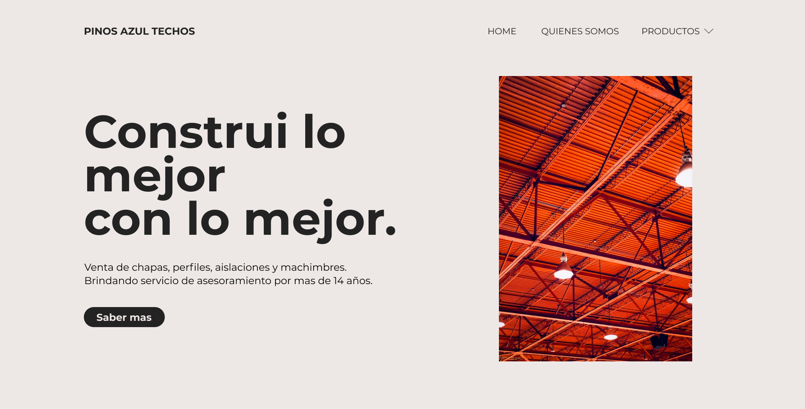

# Pinos Azul Maderas :chart_with_upwards_trend:

Professional project for Pinos Azul Maderas, a small family business of woodworking and construction supply store located in Argentina

## Authors

- [@TomasFerreras](https://github.com/TomasFerreras) :metal:

## Project
* Responsive Plants Website Using HTML, CSS and JavaScript.
* Contains animations when scrolling.
* Developed first with the Mobile First methodology.
* Compatible with all mobile devices stylish UI and functional UX.

## FAQ

### What was my role?

I worked as a freelance UX/UI designer and front-end developer. My role in this project was to do research, lo-fi & hi-fi wireframing, planning for animations and do front-end development using HTML, CSS and JS.

### How was the workflow?

The discovery phase is very important for any project. I started by asking a few questions about the project like target audience, styling, competitors, inspirational websites, etc. After defining a user and problem statement, I started researching and creating mood boards for the project.

### What i learn?

It was a fun project to work on. There were almost no constraints (eg. colors, typography, etc.). The communication went very smooth, from initial discovery to designing and through the final revisions and delivery.

## Built with

- [HTML](https://developer.mozilla.org/en-US/docs/Web/HTML)
- [CSS](https://developer.mozilla.org/en-US/docs/Web/CSS)
- [Javascript](https://www.javascript.com/)
- [GSAP](https://greensock.com/gsap/)
